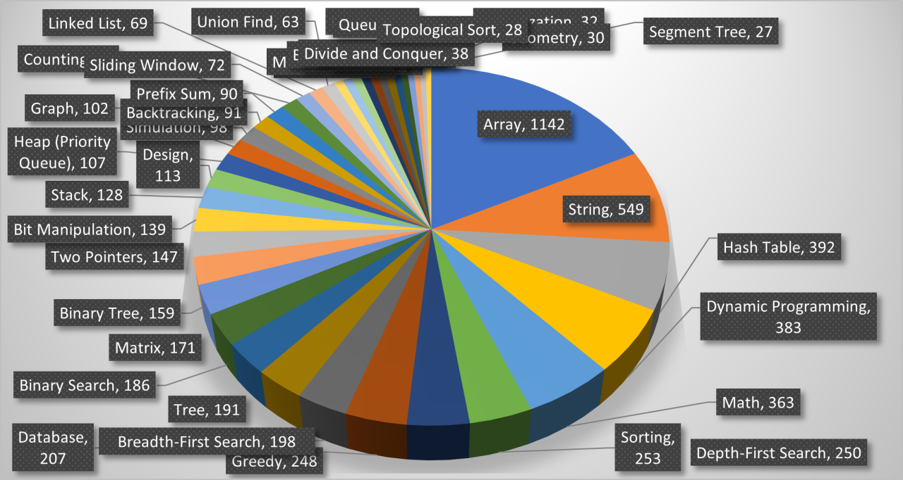

# Leetcode

 

## Top Data Structures with Best ROI

Here are the top Data Structures with the highest return on investment:

- Array (1142 problems)
- String (549)
- Hash Table (392)
- Tree (191)
- Matrix (171)
- Stack (128)
- Heap or Priority Queue (107)
- Graph (102)
- Linked List (69)
- Trie (44)

## Top Algorithmic Techniques with Best ROI

Here are the top algorithmic techniques with the highest return on investment:

- Dynamic Programming (383)
- Sorting (253)
- Greedy (248)
- Binary Search (186)
- Backtracking (91)
- Recursion (44)
- Divide and Conquer (38)

## Top Coding Patterns with Best ROI

Here are the top coding patterns with the highest return on investment:

- Depth First Search (250)
- Breadth First Search(198)
- Binary Search (186)
- Two Pointers (147)
- Sliding Window (72)
- Monotonic Stack (44)
- Union Find (63)
- Memoization (32)
- Topological Sort (28)
- Segment Tree (27)

## Best Coding Patterns with Highest ROI

Combining all categories from the above data, here is the list of best coding patterns/techniques with the highest ROI:

1. Two Pointers (Arrays, Strings, Fast & Slow Pointer)

This pattern covers a huge set of questions related to Arrays and Strings, which are the highest tagged data structures. Fast & Slow Pointer can be easily understood as a variation of the Two Pointers pattern.

2. Sliding Window (Arrays, Strings, Hash Tables)

Sliding Window covers most of the problems related to top data structures like Arrays, Strings, and HashTables.

3. Tree and Graph Depth First Search (Matrix Traversal)

Most Trees and Graphs problems can be solved using Depth First Search (DFS). Matrix Traversal, which is also DFS based pattern, covers most of the matrix-related problems.

4. Tree and Graph Breadth First Search (Queue, Subsets, Matrix Traversal, Topological Sort)

Breadth First Search (BFS) is a very handy pattern. BFS patterns like Subsets, Matrix Traversal, and Topological Sort cover a good number of problems.

5. Binary Search (Arrays)

Binary Search and its variants are used to solve a huge number of coding questions.

6. Interval Merge

Although there are not many problems related to Interval Merge, these problems frequently appear in coding interviews.

7. Recursion/Backtracking

Backtracking and recursion are used to solve a wide range of problems. Mastering these techniques is highly recommended.

## Reference

[Top LeetCode Patterns to Use for FAANG Coding Interviews](https://hackernoon.com/top-leetcode-patterns-for-faang-coding-interviews)
